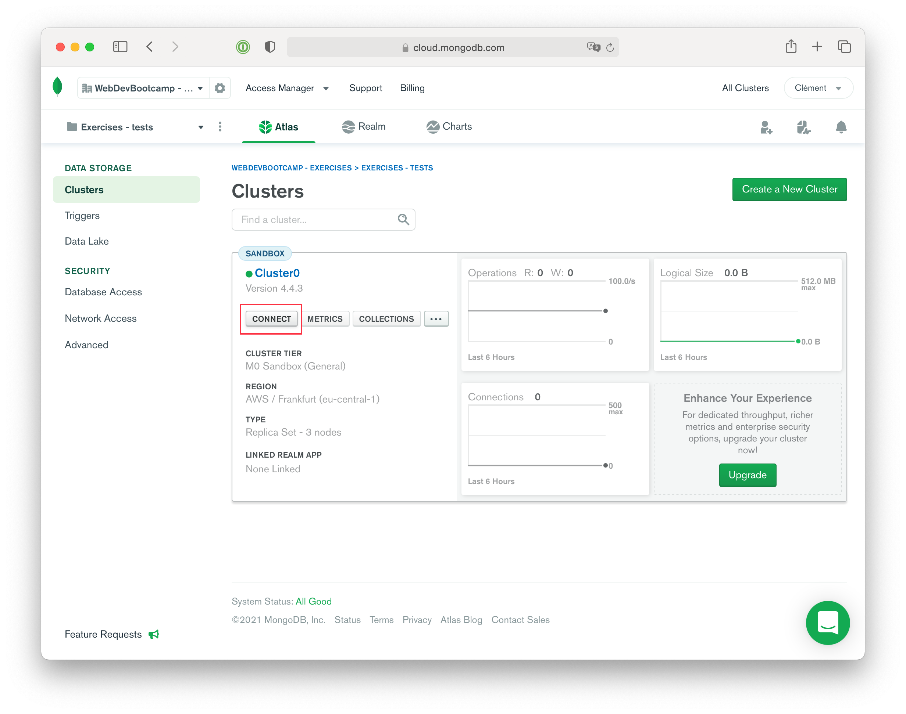

# CREATE A DATABASE ON ATLAS

## CONTEXT AND OBJECTIVES

We need a place to store our data.

We could have installed MongoDB directly on our computer but it would mean update the installation regularly, clean it to avoir having hundreds of unused databases, etc...

To ease the process and make our databases reachable from anywhere we want, we will use MongoDB Atlas rather than a local MongoDB instance.

## SPECS

Once you created your account on https://www.mongodb.com/cloud/atlas, follow these steps to get a working database for your exercises.

### Create an organisation

At first, Atlas need an organisation to manage your online databases. It's ok to have an organisation where you are the only collaborator, you will still be able to add more people later if you want.


### Create a project

After the organisation, you will need to create a project:


> 1️⃣ Choose a project name
>
> 2️⃣ Create the project
>
> You can also add collaborators if you want.

### Create a cluster for the new project

A cluster is a swarm of database. You can have a single on inside or have multiple databases. For now, let's start with one cluster creation:


> 1️⃣ For the courses we chose **AWS** (Amazon Web Services) and the Frankfurt region, because it is close to us.
>
> 2️⃣ You can change the cluster's name if you want (Optional).
>
> 3️⃣ It's time to create the cluster!


> Wait a couple of minutes for your cluster to be created.

### Contact the cluster

Now you have a working cluster, it is time to contact it with your code.




> For simplicity purposes, chose "Allow Access from Anywhere", otherwise you will have to add multiple IP addresses during the bootcamp and it would become tedious.
>
> Don't be afraid, allowing access from a place doesn't mean anybody can contact your databases!


> 1️⃣ Chose the user credentials. It is advised to generate a complex password with the dedicated `Autogenerate Secure Password` button.
> **SAVE THIS PASSWORD SOMEWHERE, YOU WILL NEED IT.** If you forgot to do it, don't worry too much since you can edit it later.
>
> 2️⃣ Create your database user.

You can then choose a connection method. Here, we need to connect the Application (the tests files) to check if your database url is the good one:


### Add the url to the code

Keep only this part of your url, without the database name:

```
mongodb+srv://<your-username>:<your-password>@cluster0.djg4e.mongodb.net/
```

Then, in order to use it in your code, you need to make it and environment variable:
- 1️⃣ Create a `.env_vars` file
- 2️⃣ **BE EXTRA SURE** that it is added to your `.gitignore` file to avoid revealing your password on Github on a push.
- 2️⃣ **BE EXTRA SURE** that it is added to your `.gitignore` file to avoid revealing your password on Github on a push.
- 2️⃣ **BE EXTRA SURE** that it is added to your `.gitignore` file to avoid revealing your password on Github on a push.
- 3️⃣ add the database url in the `.env_vars` file:

  ```bash
  export MONGODB_DATABASE_URL='mongodb+srv://<your-username>:<your-password>@<cluster-name>.djg4e.mongodb.net/'
  ```
  > Change the placeholders with your own credentials.

- 4️⃣ source your file:

  ```bash
  source .env_vars
  ```

**You will have to do this in every exercise for the MongoDB days 😉**

Now it's time to check with `yarn test`! Is it all green?
