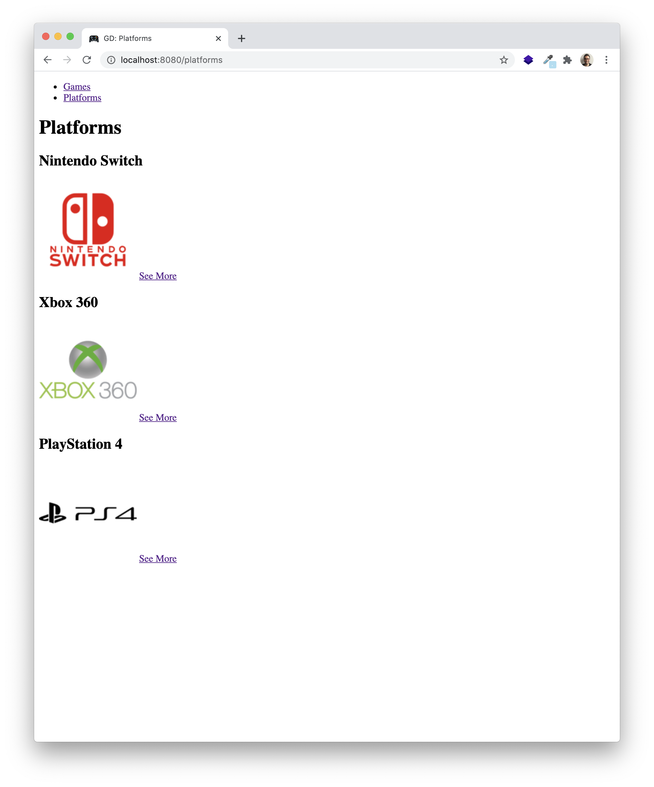
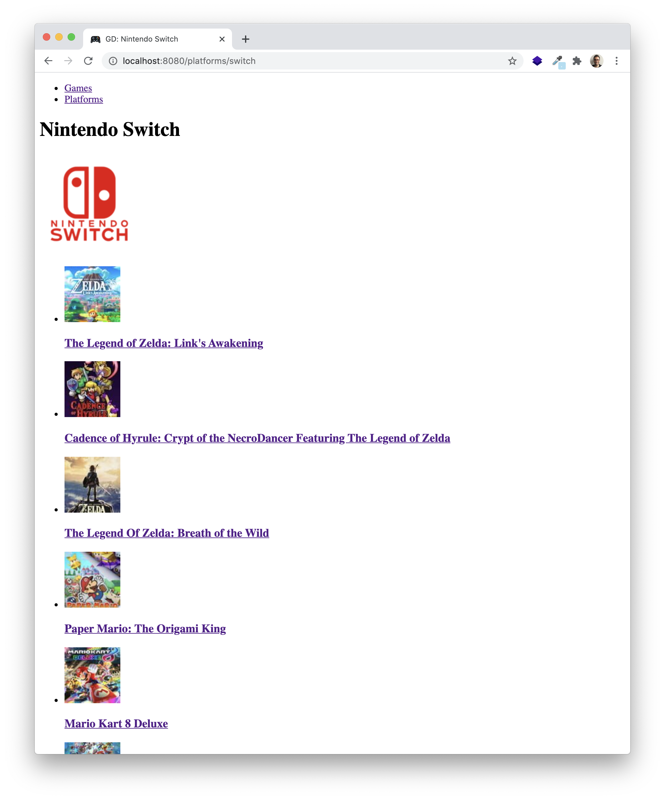
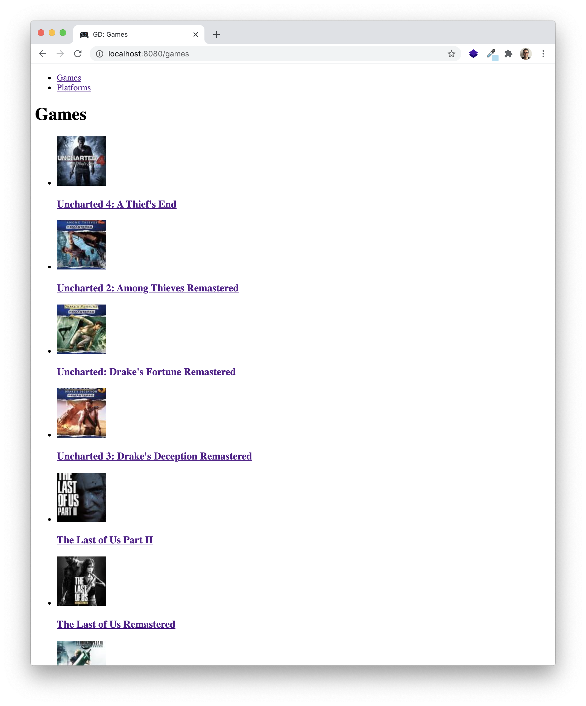
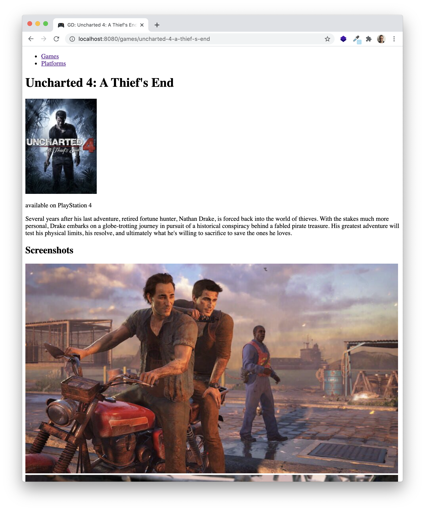
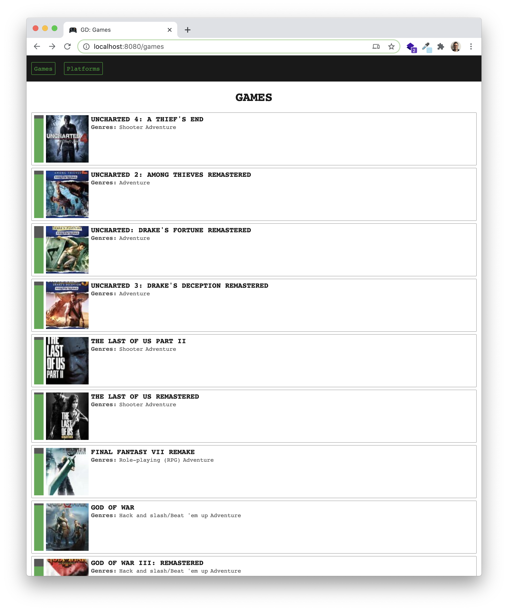

# HTML or JSON, that is the question

## Context and objectives

At the moment, you should have a fully functional video games catalog API.

Now, let's be honest a second. It is cool and fun for developpers, but is it for casual users?

Not really, so you need to provide to standard users a fully functional ... HTML website, while keeping the API for the users who want tu use it.

## SPECS

### Add HTML responses in the existing endpoints

For now, your API endpoints send JSON responses, pretty much like this:

```typescript
// src/server.ts
function show(platformModel: PlatformModel) {
  return async (
    request: express.Request,
    response: express.Response
  ): Promise<void> => {
    const platform = await platformModel.findBySlug(request.params.slug);
    if (platform) {
      response.json(platform);
    } else {
      response.status(404).json({ error: "This platform does not exist." });
    }
  };
}
```

or without `async/await`

```typescript
// src/server.ts
function show(platformModel: PlatformModel) {
  return (
    request: express.Request,
    response: express.Response
  ): Promise<void> => {
    platformModel.findBySlug(request.params.slug).then((platform) => {
      if (platform) {
        response.json(platform);
      } else {
        response.status(404).json({ error: "This platform does not exist." });
      }
    });
  };
}
```

You need to add the **Nunjucks** templating part.

Given that you have a `views/platform.njk` and a `views/not-found.njk` templates:

```typescript
// src/server.ts
const clientWantsJson = (request: express.Request): boolean =>
  request.get("accept") === "application/json";

function show(platformModel: PlatformModel) {
  return async (
    request: express.Request,
    response: express.Response
  ): Promise<void> => {
    const platform = await platformModel.findBySlug(request.params.slug);

    if (platform) {
      if (clientWantsJson(request)) {
        response.json(platform);
      } else {
        response.render("platform", { platform });
      }
    } else {
      response.status(404);
      if (clientWantsJson(request)) {
        response.json({ error: "This platform does not exist." });
      } else {
        response.render("platform", { platform });
      }
    }
  };
}
```

> The `clientWantsJson` function use `request.get("accept")` to see if the headers contain a key `"Accept"` or `"accept"` with the value `"application/json"` which would mean that the client ask specifically for a JSON endpoint.

🔎 **You need to transform four endpoints to send both JSON and HTML:**

- `GET platforms`
- `GET platforms/:id`
- `GET games/`
- `GET games/:id`

⚠️ Don't forget to either have an `.env_vars` or a `.env` file for your MongoDB URL! ⚠️

### HTML templates

This way, if the client you use has `"Accept": "application/json"` in its resquest's headers, you will get a JSON response and if not, you'll get an HTML page.

Have a look at what you should have at the end of this step:






### Add style

Now it's time to add some CSS and to have some nice styled HTML pages to display to the users!

Here are some things you could look at:

- [CSS Selectors](https://developer.mozilla.org/en-US/docs/Web/CSS/CSS_Selectors).
- [Pseudo Classes](https://developer.mozilla.org/en-US/docs/Web/CSS/Pseudo-classes) to select elements in a more detail way.
- [Position](https://developer.mozilla.org/en-US/docs/Web/CSS/position) when yoy want to play with an element position.
- [Flexbox](https://developer.mozilla.org/en-US/docs/Web/CSS/CSS_Flexible_Box_Layout/Basic_Concepts_of_Flexbox): Another way of how to position elements.

Be curious, search for examples and try them. Here are some videogames website to give you some ideas:

- [IGDB](https://www.igdb.com/discover)
- [Game Cash](https://www.gamecash.fr/)
- [Extra-life](https://www.extralife.fr/jeux-video)

And here's an example of what you can do:



# HAVE FUN!
