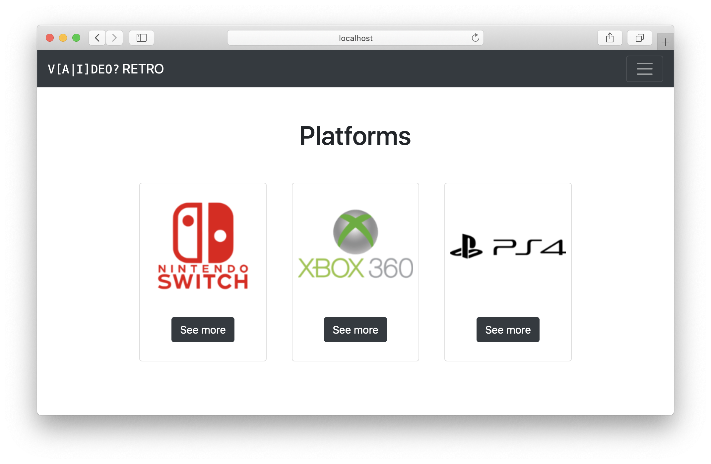

# Bootstraped Videogames

## Context and objectives

At the moment you should have a website with some hand written CSS style. It's time to speed up and ease the process by using Bootstrap to make your App nice and sexy!

## Specs

Copy your code from yesterday in the `src` folder and continue on.

### Bootstrap

With the help of the **[Bootstrap documentation](https://getbootstrap.com/docs/5.0/getting-started/introduction/)**, it's time to rework the front-end part of your web application!

### Home page

Let's start by creating a home page!

To do so, start by adding the route in the `src/server.ts` file.

Then, create the nunjucks page in the `view` directory and don't forget to use the layout:

```html
<!-- 'views/home.njk' -->



  <!-- Your content goes here -->

```

It would be nice to have a [Navbar](https://getbootstrap.com/docs/5.0/components/navbar/) right?

You should also add a nice banner!

Then, add some buttons to guide your users 😉.

Maybe you'll end up with something like this:


> To produce this, there are mostly Bootstrap classes and just a litlle bit of CSS for the [background-image](https://developer.mozilla.org/en-US/docs/Web/CSS/background-image) size and position.

### Catalog pages

When you're done with the homepage, it's time to style the rest of your web application's pages!

For now, start with the `GET` routes:
- `GET platforms/`
- `GET platforms/:id`
- `GET games/`
- `GET games/:id`

You could have something like that in the end:


> `GET platforms/`


> `GET games/`
