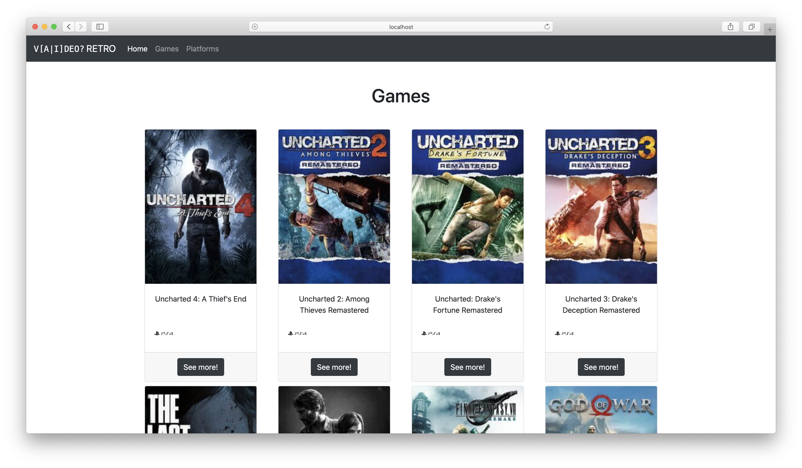
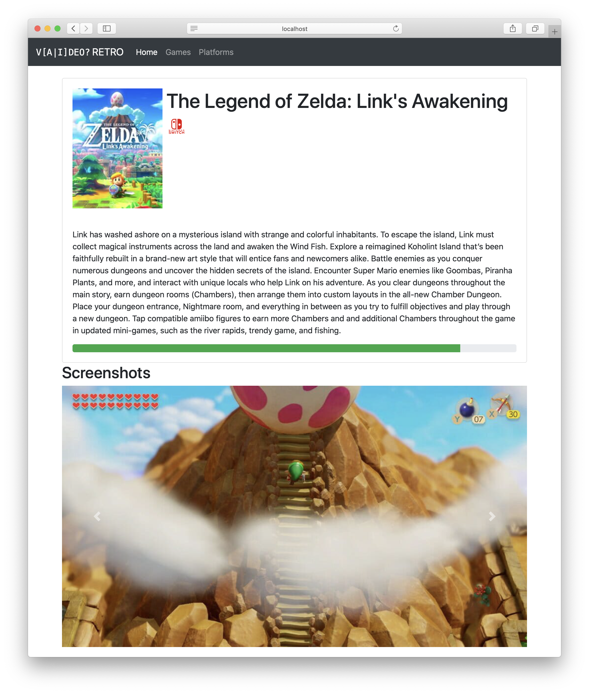

# Bootstraped Video games V2

## Context and objectives

Now that we have a basic bootstraped app with some nice basic pages, it's time to fully use the Bootstrap grid system to do responsive design.

## Specs

### Goal

With the help of the **Boostrap Grid layout**, make your pages look good on different devices screen width.

You can find how to make this happen with the [documentation](https://getbootstrap.com/docs/5.0/layout/grid/).

Add this layout to your pages and use it to make them more responsive than they are right now.

### Examples

For example, you can use [cards](https://getbootstrap.com/docs/5.0/components/card/) inside `col` and end up with something that can look like this:

